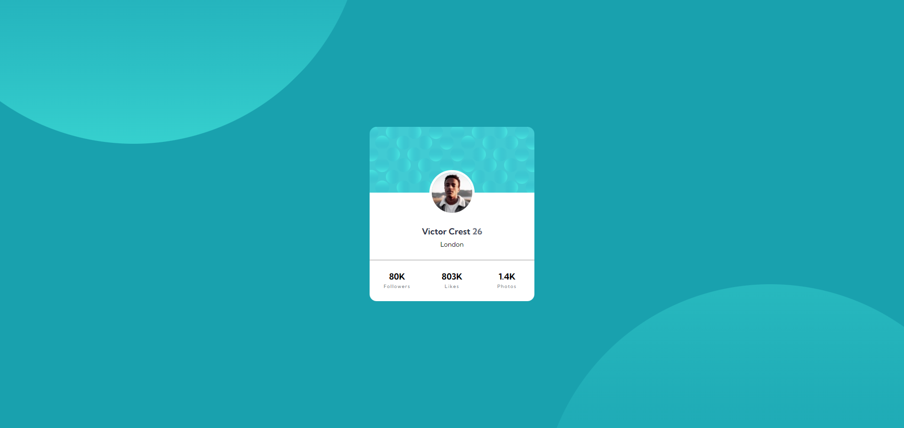

# Frontend Mentor - Profile card component

## Overview

### Screenshot

#### Desktop

### Links

- Live Site URL: [https://codermoshiur.github.io/profile-card-component/](https://codermoshiur.github.io/profile-card-component/)
- Solution URL: [https://www.frontendmentor.io/solutions/profile-card-component-using-sass-DXvwNwrCyW](https://www.frontendmentor.io/solutions/profile-card-component-using-sass-DXvwNwrCyW)

## My process

### Built with

- Semantic HTML5 markup
- Sass
- CSS Grid
- BEM Methodology

## Author

- Website - [Moshiur](https://codersfoundation.com)
- Youtube - [@moshiur](https://www.youtube.com/moshiur)
- Facebook - [@codermoshiur](https://www.facebook.com/codermoshiur)
- Frontend Mentor - [@codermoshiur](https://www.frontendmentor.io/profile/codermoshiur)
